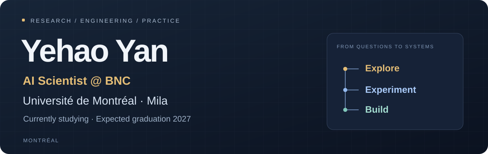

  

  <strong>AI Scientist @ BNC</strong> 
  <strong>Université de Montréal · Mila</strong> 
  Currently studying · Expected graduation 2027 · Montréal

  <a href="#selected-work">Selected work</a> ·
  <a href="#research-to-practice">Research to practice</a> ·
  <a href="#what-im-building-toward">What I'm building toward</a>

---

## Hi, I'm Yehao.

I work as an **AI Scientist at BNC** and am currently studying at **Université de Montréal**, with a **Mila** background. I expect to graduate in **2027**.

My projects span **reinforcement learning, robot learning, local LLM applications, and workflow automation**. I like turning a question into an experiment—and a recurring problem into a tool I actually use.

## Selected work

<table>
  <tr>
    <td width="50%" valign="top">
      01 / ROBOT LEARNING
      <h3><a href="https://github.com/Yannyehao/Isaac-Lab-Push">Isaac Lab Push ↗</a></h3>
      
Multi-block manipulation with reinforcement learning and hierarchical control in Isaac Lab.

      
Research project supervised by <strong>Prof. Glen Berseth</strong>.

      
<code>PPO</code> <code>Isaac Lab</code> <code>Hierarchical control</code>

    </td>
    <td width="50%" valign="top">
      02 / REINFORCEMENT LEARNING &amp; PLANNING
      <h3><a href="https://github.com/Yannyehao/IFT6759-Splendor">Splendor AI ↗</a></h3>
      
Studying reward shaping and guided lookahead for a board game with a large, changing action space.

      
IFT6759 course project with comparative evaluations, ablations, and documented unsuccessful approaches.

      
<code>MaskablePPO</code> <code>Planning</code> <code>Evaluation</code>

    </td>
  </tr>
  <tr>
    <td width="50%" valign="top">
      03 / LOCAL AI TOOL
      <h3><a href="https://github.com/Yannyehao/ZhType">ZhType ↗</a></h3>
      
<strong>Type Chinese. Write English or French.</strong> A local LLM translation layer at the desktop cursor.

      
An experimental Windows tool built around a real multilingual workflow.

      
<code>Ollama</code> <code>Qwen</code> <code>Python</code>

    </td>
    <td width="50%" valign="top">
      04 / SYSTEMS &amp; AUTOMATION
      <h3><a href="https://github.com/Yannyehao/zAI-public">zAI ↗</a></h3>
      
A personal system connecting learning tools, market screening, candidate tracking, and operational diagnostics.

      
A public architecture journal with module guides and engineering lessons. Implementation and source materials remain private.

      
<code>RAG</code> <code>Automation</code> <code>Observability</code>

    </td>
  </tr>
</table>

## Research to practice

| Area | What I work on |
|---|---|
| **Learning &amp; decision-making** | Reinforcement learning, reward design, planning, and robot learning |
| **AI applications** | Local inference, retrieval, and tools that fit everyday workflows |
| **Systems engineering** | Pipelines, diagnostics, recovery, and traceable project records |

I care about clear baselines, reproducible experiments, and understanding why an approach fails. For tools, I care about what happens after the first successful run: how they are used, checked, and maintained.

## What I'm building toward

- Completing my studies, with expected graduation in **2027**.
- Developing practical AI tools alongside my work and studies.
- Sharing more demonstrations, architecture notes, and lessons from my personal projects.

---

<strong>Curiosity → experiments → useful tools.</strong>

Montréal · Personal projects and research work; no employer project details are shared here.

